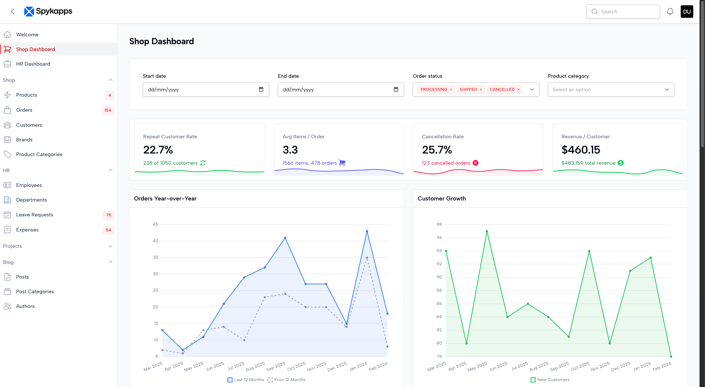
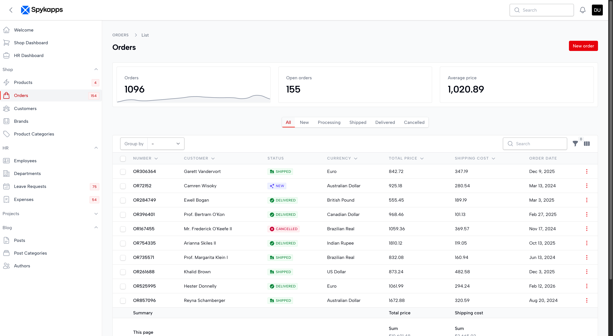
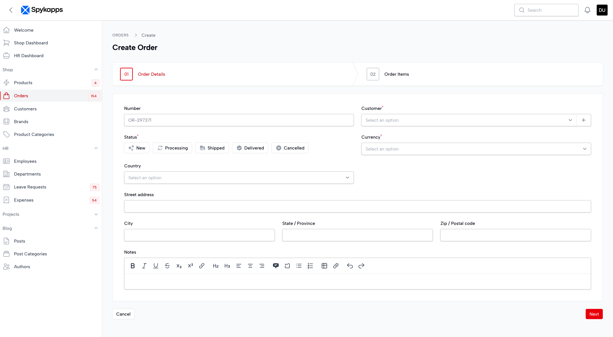
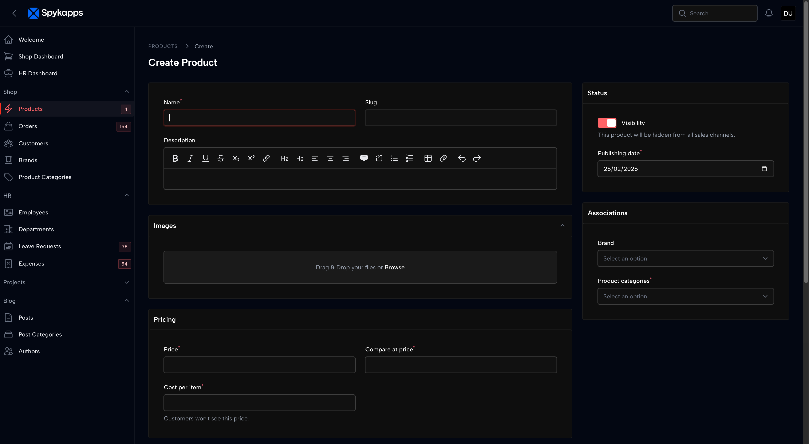
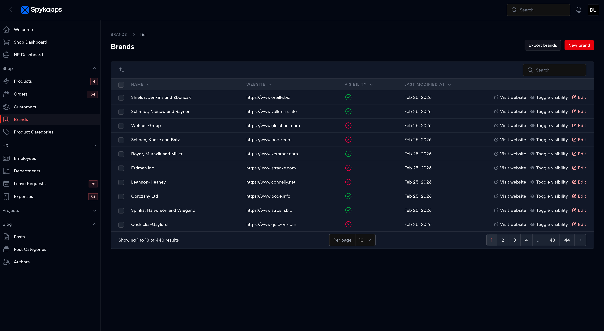
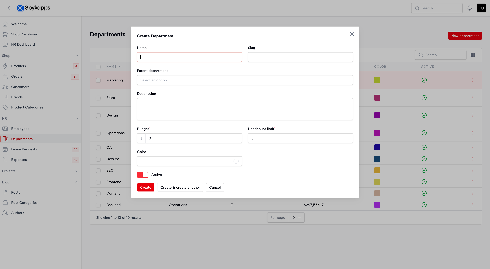

<p align="center">
   <a href="https://packagist.org/packages/spykapps/theme-inverness">
    
   </a>
   <a href="https://packagist.org/packages/spykapps/theme-inverness">
    
   </a>
   <a href="https://laravel.com/docs/12.x"></a>
   <a href="https://php.net"></a>
   <a href="https://github.com/spykapps/theme-inverness/blob/main/LICENSE.md">
     
   </a>
</p>


# Inverness - A Premium Filament Theme by Spykapps

A refined, minimal Filament theme with tight spacing, subtle shadows, and Laravel-red accents. Designed for Filament v4 and v5.

---

## Screenshots

| | |
|---|---|
|  |  |
|  |  |
|  |  |

## Installation

```bash
composer require spykapps/theme-inverness
```

Then run the install command:

```bash
php artisan inverness:install
```

The command will:

1. Detect your Filament panels (or ask you to choose one if multiple exist)
2. Create a theme CSS file if one doesn't exist yet
3. Add the Inverness stylesheet import automatically

### Register the Plugin

Add the plugin to your panel provider:

```php
use SpyApp\ThemeInverness\ThemeInvernessPlugin;

public function panel(Panel $panel): Panel
{
    return $panel
        // ...
        ->plugin(ThemeInvernessPlugin::make());
}
```

### Compile Assets

```bash
npm run build
```

## Features

- **Tight border-radius** — Clean 4px corners throughout
- **Refined shadows** — Subtle, layered box-shadows for light & dark modes
- **Laravel-red accents** — Primary buttons, active sidebar indicators, focus rings
- **Compact spacing** — Denser tables, sections, and form elements
- **Dark mode** — Full dark mode support with carefully tuned values
- **Smooth transitions** — 100ms/180ms transitions on interactive elements

## Credits

- [Sanchit Patil](https://github.com/sanchitspatil)
- [All Contributors](../../contributors)

## License

The MIT License (MIT). Please see [License File](LICENSE.md) for more information.
